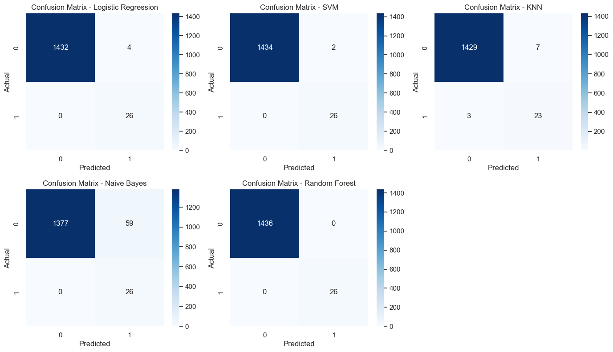
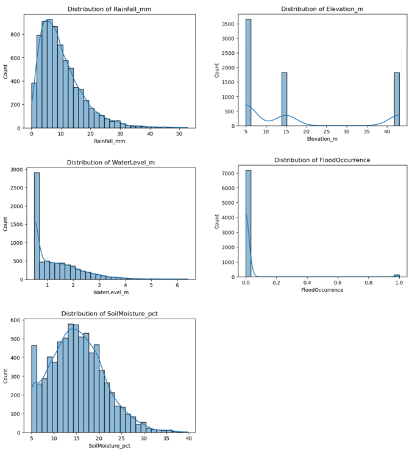
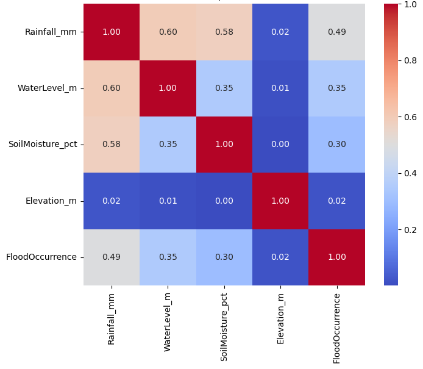

# Flood Prediction in Metro Manila with Machine Learning

Predicting whether a flood occurs on a given day in four Metro Manila cities, and comparing five classification models on a heavily imbalanced dataset (only 1.8% of records are flood days).

Individual course project from my Master's in Data Science at OsloMet. Built with Python, pandas and scikit-learn.

## Summary

- **Problem:** binary classification of daily flood occurrence from rainfall, water level, soil moisture and elevation.
- **Data:** 7,308 daily records for four cities (Quezon City, Marikina, Manila, Pasig), 2016-2020, from [Kaggle](https://www.kaggle.com/datasets/denvermagtibay/metro-manila-flood-prediction-20162020-daily).
- **Approach:** stratified 80/20 split. Each model sits in one pipeline (`StandardScaler`, then SMOTE, then the model) tuned with `GridSearchCV` (5-fold cross-validation, scored on F1). Because SMOTE is inside the pipeline, it only resamples training folds and never touches validation folds or the test set.
- **Models compared:** Logistic Regression, SVM, KNN, Naive Bayes, Random Forest.
- **Evaluation:** precision, recall, F1, ROC-AUC and confusion matrices. Accuracy alone is misleading here, because 98.2% of records are non-flood days.
- **Result:** Random Forest made no errors on the held-out test set. Rainfall was the strongest predictor in every model where importance could be measured.

## Results

Held-out test set: 1,462 records, of which 26 are floods. "CV F1" is the mean 5-fold cross-validated F1 on the training data (the score used to choose hyperparameters). All other columns are test-set results.

| Model | CV F1 | Accuracy | Precision | Recall | F1 | ROC-AUC | False positives | False negatives |
|---|---|---|---|---|---|---|---|---|
| Logistic Regression | 0.933 | 0.997 | 0.867 | 1.000 | 0.929 | 1.000 | 4 | 0 |
| SVM | 0.973 | 0.999 | 0.929 | 1.000 | 0.963 | 1.000 | 2 | 0 |
| KNN | 0.909 | 0.993 | 0.767 | 0.885 | 0.821 | 0.979 | 7 | 3 |
| Naive Bayes | 0.495 | 0.960 | 0.306 | 1.000 | 0.468 | 1.000 | 59 | 0 |
| **Random Forest** | **1.000** | **1.000** | **1.000** | **1.000** | **1.000** | **1.000** | **0** | **0** |

Logistic Regression and SVM caught every flood with only 4 and 2 false alarms. Naive Bayes also caught every flood but raised 59 false alarms, and KNN missed 3 floods.



<details>
<summary>Tuned hyperparameters</summary>

| Model | Best parameters found by GridSearchCV |
|---|---|
| Logistic Regression | `C=10`, `penalty="l2"`, `solver="lbfgs"` |
| SVM | `C=10`, `kernel="linear"`, `gamma="scale"` |
| KNN | `n_neighbors=3`, `weights="uniform"`, `p=2` |
| Naive Bayes | `var_smoothing=1e-9` |
| Random Forest | `n_estimators=100`, `max_depth=None`, `min_samples_split=2` |

</details>

### What drives the predictions

| Feature | Logistic Regression (coefficient) | SVM (coefficient) | Random Forest (importance) |
|---|---|---|---|
| Rainfall (mm) | 23.819 | 14.451 | 0.694 |
| Soil moisture (%) | 0.437 | 0.173 | 0.174 |
| Water level (m) | -0.151 | -0.049 | 0.131 |
| Elevation (m) | 0.132 | 0.126 | 0.001 |

Linear-model coefficients are on scaled features. Rainfall dominates in all three models. Water level correlates with flooding (0.35) but gets a near-zero coefficient in the linear models, probably because it overlaps with rainfall (correlation 0.60). Elevation takes only three distinct values (one per city, with Manila and Pasig sharing one), so it adds little beyond identifying the city.

<details>
<summary>Exploratory analysis figures</summary>





Correlation with flood occurrence: rainfall 0.49, water level 0.35, soil moisture 0.30, elevation 0.02.

</details>

## Limitations

These results should be read with care.

- **Near-perfect scores on a small test set.** The test set contains only 26 flood events, so one or two mistakes would change precision and F1 noticeably. An F1 of 1.0 here is not evidence of real-world reliability.
- **The data may be unusually clean.** Scores this high often mean the label is largely determined by the input columns, for example in a generated or rule-based dataset. Random Forest also reaches a cross-validated F1 of 1.000 on the training data, which is consistent with that. I did not verify how the Kaggle dataset was produced, so I treat the results as specific to this dataset.
- **Random split on time-series data.** A stratified random split lets neighbouring days from the same city land in both training and test sets. A chronological split or a leave-one-city-out split would be a stricter test.
- **Accuracy is a weak metric here.** Always predicting "no flood" would already score about 98.2%, which is why the comparison focuses on precision, recall, F1 and ROC-AUC.

## What I would try next

- Chronological train/test split, and leave-one-city-out evaluation.
- Compare against a simple baseline such as a rainfall threshold, to see how much the models add.
- Look at predicted probabilities and choose the decision threshold based on the cost of missed floods versus false alarms.

## Notebooks

| Notebook | What it covers |
|---|---|
| [`notebooks/01_eda_and_baseline.ipynb`](notebooks/01_eda_and_baseline.ipynb) | Data checks, distributions, correlations, and a first comparison of models with default settings |
| [`notebooks/02_smote_tuning_and_evaluation.ipynb`](notebooks/02_smote_tuning_and_evaluation.ipynb) | Stratified split, scaler + SMOTE + model pipelines, GridSearchCV, the final evaluation reported above, and feature importance. Random seeds are fixed (`random_state=42`). |

The numbers in this README come from the saved outputs of notebook 02.

## Repository structure

```
flood-prediction-ml/
├── README.md
├── requirements.txt
├── data/
│   └── README.md          # how to download the dataset
├── notebooks/
│   ├── 01_eda_and_baseline.ipynb
│   └── 02_smote_tuning_and_evaluation.ipynb
└── images/                # figures used in this README
```

## How to run

```bash
git clone https://github.com/<your-username>/flood-prediction-ml.git
cd flood-prediction-ml
python -m venv .venv
source .venv/bin/activate        # Windows: .venv\Scripts\activate
pip install -r requirements.txt
```

Download the dataset as described in [`data/README.md`](data/README.md), then start Jupyter:

```bash
jupyter notebook
```

## How I used AI tools

AI tools were used as assistants. The analysis, interpretation and conclusions are my own.

- ChatGPT helped generate Python code for data processing and visualization.
- NotebookLM helped summarize and organize related literature.
- ChatGPT and Grammarly helped improve the clarity of the written report.

## Author

Ruth Navarro · www.linkedin.com/in/ruth-navarro22 · ruthcnavarro22@gmail.com
